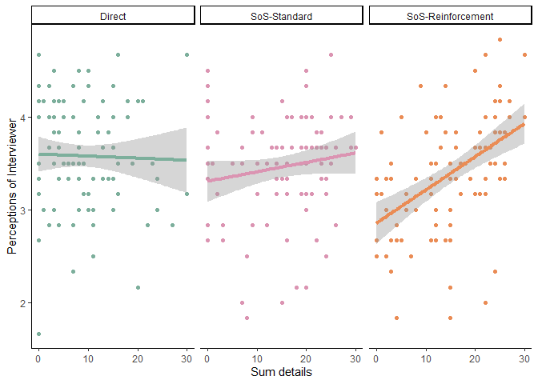
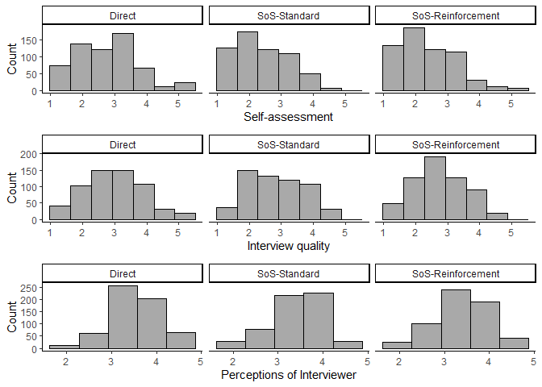

SoS Reinforcement - Main report
================
2023-10-25

- <a href="#demographics" id="toc-demographics">Demographics</a>
  - <a href="#age" id="toc-age">Age</a>
  - <a href="#gender" id="toc-gender">Gender</a>
- <a href="#motivation--engagement"
  id="toc-motivation--engagement">Motivation &amp; Engagement</a>
  - <a href="#engagement" id="toc-engagement">Engagement</a>
  - <a href="#motivation" id="toc-motivation">Motivation</a>
- <a href="#disclosed-details" id="toc-disclosed-details">Disclosed
  details</a>
  - <a href="#icc" id="toc-icc">ICC</a>
  - <a href="#descriptives" id="toc-descriptives">Descriptives</a>
    - <a href="#all-information-stage-1-5"
      id="toc-all-information-stage-1-5">All information (Stage 1-5)</a>
    - <a href="#critical-information-stage-5--6"
      id="toc-critical-information-stage-5--6">Critical information (Stage 5
      &amp; 6)</a>
  - <a href="#interrupted-time-series-linear-mixed-effects-models"
    id="toc-interrupted-time-series-linear-mixed-effects-models">Interrupted
    time series linear mixed effects models</a>
    - <a href="#main-effect-model" id="toc-main-effect-model">Main effect
      model</a>
    - <a href="#interaction-effect-model"
      id="toc-interaction-effect-model">Interaction effect model</a>
    - <a href="#comparing-main-and-interaction-model-fit"
      id="toc-comparing-main-and-interaction-model-fit">Comparing main and
      interaction model fit</a>
    - <a href="#comparing-disclosure-of-critical-details-direct-vs-standard"
      id="toc-comparing-disclosure-of-critical-details-direct-vs-standard">Comparing
      disclosure of critical details, Direct vs. Standard</a>
    - <a
      href="#comparing-disclosure-of-critical-details-direct-vs-reinforcement"
      id="toc-comparing-disclosure-of-critical-details-direct-vs-reinforcement">Comparing
      disclosure of critical details, Direct vs. Reinforcement</a>
    - <a
      href="#comparing-disclosure-of-critical-details-standard-vs-reinforcement"
      id="toc-comparing-disclosure-of-critical-details-standard-vs-reinforcement">Comparing
      disclosure of critical details, Standard vs. Reinforcement</a>
  - <a href="#self-reports-of-changing-strategy"
    id="toc-self-reports-of-changing-strategy">Self-reports of changing
    strategy</a>
    - <a href="#desriptives" id="toc-desriptives">Desriptives</a>
    - <a href="#chi-square-direct-vs-standard"
      id="toc-chi-square-direct-vs-standard">Chi-square, Direct
      vs. Standard</a>
    - <a href="#chi-square-direct-vs-reinforcement"
      id="toc-chi-square-direct-vs-reinforcement">Chi-square, Direct
      vs. Reinforcement</a>
    - <a href="#chi-square-standard-vs-reinforcement"
      id="toc-chi-square-standard-vs-reinforcement">Chi-square, Standard
      vs. Reinforcement</a>
- <a href="#self-assessment-of-performance"
  id="toc-self-assessment-of-performance">Self-assessment of
  performance</a>
  - <a href="#reliability" id="toc-reliability">Reliability</a>
  - <a href="#descriptive-statistics"
    id="toc-descriptive-statistics">Descriptive statistics</a>
  - <a href="#pairwise-comparisons" id="toc-pairwise-comparisons">Pairwise
    comparisons</a>
    - <a href="#direct-vs-standard" id="toc-direct-vs-standard">Direct
      vs. Standard</a>
    - <a href="#direct-vs-reinforcement"
      id="toc-direct-vs-reinforcement">Direct vs. Reinforcement</a>
    - <a href="#standard-vs-reinforcement"
      id="toc-standard-vs-reinforcement">Standard vs. Reinforcement</a>
  - <a href="#tost" id="toc-tost">TOST</a>
    - <a href="#standard-vs-reinforcement-1"
      id="toc-standard-vs-reinforcement-1">Standard vs. Reinforcement</a>
  - <a href="#comparison-to-the-midpoint"
    id="toc-comparison-to-the-midpoint">Comparison to the midpoint</a>
    - <a href="#direct" id="toc-direct">Direct</a>
    - <a href="#standard" id="toc-standard">Standard</a>
    - <a href="#reinforcement" id="toc-reinforcement">Reinforcement</a>
- <a
  href="#the-relationship-between-self-assessment-of-performance-and-disclosed-details-for-each-condition-exploratory"
  id="toc-the-relationship-between-self-assessment-of-performance-and-disclosed-details-for-each-condition-exploratory">The
  relationship between self-assessment of performance and disclosed
  details for each condition (Exploratory)</a>
  - <a href="#main-effects-model" id="toc-main-effects-model">Main effects
    model</a>
  - <a href="#interaction-effects-model"
    id="toc-interaction-effects-model">Interaction effects model</a>
  - <a href="#comparison-of-model-fit"
    id="toc-comparison-of-model-fit">Comparison of model fit</a>
  - <a href="#plot" id="toc-plot">Plot</a>
- <a
  href="#the-relationship-between-interviewer-perception-and-disclosed-details-for-each-condition-exploratory"
  id="toc-the-relationship-between-interviewer-perception-and-disclosed-details-for-each-condition-exploratory">The
  relationship between interviewer perception and disclosed details for
  each condition (Exploratory)</a>
  - <a href="#main-effect-model-1" id="toc-main-effect-model-1">Main effect
    model</a>
  - <a href="#interaction-effect-model-1"
    id="toc-interaction-effect-model-1">Interaction effect model</a>
  - <a href="#comparison-of-model-fit-1"
    id="toc-comparison-of-model-fit-1">Comparison of model fit</a>
  - <a href="#plot-1" id="toc-plot-1">Plot</a>
- <a href="#interview-quality" id="toc-interview-quality">Interview
  Quality</a>
  - <a href="#reliability-1" id="toc-reliability-1">Reliability</a>
  - <a href="#descriptice-statistics"
    id="toc-descriptice-statistics">Descriptice statistics</a>
  - <a href="#comparison-to-negative-endpoint"
    id="toc-comparison-to-negative-endpoint">Comparison to negative
    endpoint</a>
    - <a href="#direct-1" id="toc-direct-1">Direct</a>
    - <a href="#standard-1" id="toc-standard-1">Standard</a>
    - <a href="#reinforcement-1" id="toc-reinforcement-1">Reinforcement</a>
  - <a href="#pairwise-comparisons-1"
    id="toc-pairwise-comparisons-1">Pairwise comparisons</a>
    - <a href="#directs-vs-standard" id="toc-directs-vs-standard">Directs
      vs. Standard</a>
    - <a href="#direct-vs-reinforcement-1"
      id="toc-direct-vs-reinforcement-1">Direct vs. Reinforcement</a>
    - <a href="#standard-vs-reinforcement-2"
      id="toc-standard-vs-reinforcement-2">Standard vs. Reinforcement</a>
  - <a href="#tost-1" id="toc-tost-1">TOST</a>
    - <a href="#direct-vs-standard-1" id="toc-direct-vs-standard-1">Direct
      vs. Standard</a>
    - <a href="#standard-vs-reinforcement-3"
      id="toc-standard-vs-reinforcement-3">Standard vs. Reinforcement</a>
- <a href="#interviewer-perception"
  id="toc-interviewer-perception">Interviewer Perception</a>
  - <a href="#reliability-2" id="toc-reliability-2">Reliability</a>
  - <a href="#descriptives-1" id="toc-descriptives-1">Descriptives</a>
  - <a href="#comparison-to-the-negative-endpoint"
    id="toc-comparison-to-the-negative-endpoint">Comparison to the negative
    endpoint</a>
    - <a href="#direct-2" id="toc-direct-2">Direct</a>
    - <a href="#standard-2" id="toc-standard-2">Standard</a>
    - <a href="#reinforcement-2" id="toc-reinforcement-2">Reinforcement</a>
  - <a href="#pairwise-comparisons-2"
    id="toc-pairwise-comparisons-2">Pairwise comparisons</a>
    - <a href="#directs-vs-standard-1" id="toc-directs-vs-standard-1">Directs
      vs. Standard</a>
    - <a href="#direct-vs-reinforcement-2"
      id="toc-direct-vs-reinforcement-2">Direct vs. Reinforcement</a>
    - <a href="#standard-vs-reinforcement-4"
      id="toc-standard-vs-reinforcement-4">Standard vs. Reinforcement</a>
  - <a href="#tost-2" id="toc-tost-2">TOST</a>
    - <a href="#direct-vs-standard-2" id="toc-direct-vs-standard-2">Direct
      vs. Standard</a>
    - <a href="#standard-vs-reinforcement-5"
      id="toc-standard-vs-reinforcement-5">Standard vs. Reinforcement</a>

# Demographics

## Age

    ##      Age_M   Age_sd Age_Mdn
    ## 1 36.41751 11.88689      34

## Gender

1 = Woman 2 = Men 3 = 4 non-binary/third gender

    ## # A tibble: 4 × 2
    ##   gender     n
    ##    <int> <int>
    ## 1      1   144
    ## 2      2   148
    ## 3      3     4
    ## 4     NA     4

# Motivation & Engagement

To check make sure our participants we’re interacting with our
experimental materials we measured how engaged they were while watching
the video clips depicting the mock crimes and how motivated they were to
convince the interviewer that they were innocent. Each item was measured
with a 7-point Likert-scale.

### Engagement

    ##       Mean        SD Median        SE   Upper    Lower
    ## 1 6.508475 0.7324565      7 0.0422884 6.59136 6.425589

### Motivation

    ## # A tibble: 3 × 7
    ##   style          Mean    SD Median    SE Upper Lower
    ##   <chr>         <dbl> <dbl>  <dbl> <dbl> <dbl> <dbl>
    ## 1 direct         5.95  1.26      6 0.126  6.20  5.70
    ## 2 reinforcement  5.75  1.28      6 0.128  6.00  5.50
    ## 3 standard       6.14  1.00      6 0.100  6.34  5.95

# Disclosed details

Our primary goal was assessing the different interviewing approaches’
ability to elicit information from participants. We used a predetermined
coding scheme to assess information disclosure where scores ranged from
0-5 points for each stage of the interview. Two independent raters coded
all 300 interview transcripts. Agreement between raters was high.
Descriptive statistics and plots covering information disclosure for
each of the conditions; Direct, SoS-Standard & SoS-Reinforcement, can be
found below. Descriptive statistics for information disclosure are
presented below as well as a figure displaying information disclosure in
each of the six stages for all interview conditions.

## ICC

    ## 
    ## PARAMETRIC BOOTSTRAP
    ## 
    ## 
    ## Call:
    ## bootMer(x = disclosure_model, FUN = ICC_func, nsim = 1000)
    ## 
    ## 
    ## Bootstrap Statistics :
    ##         original        bias     std. error
    ## t1* 0.9589996860 -5.916119e-05 0.0019050336
    ## t2* 0.0002870405 -4.596899e-06 0.0002971308
    ## t3* 0.0407132736  6.375809e-05 0.0018712373

    ## 
    ## 120 message(s): boundary (singular) fit: see help('isSingular')
    ## 21 warning(s): Model failed to converge with max|grad| = 0.00206887 (tol = 0.002, component 1) (and others)

    ## BOOTSTRAP CONFIDENCE INTERVAL CALCULATIONS
    ## Based on 1000 bootstrap replicates
    ## 
    ## CALL : 
    ## boot.ci(boot.out = disclosure_boot_icc, type = "perc", index = 1)
    ## 
    ## Intervals : 
    ## Level     Percentile     
    ## 95%   ( 0.9550,  0.9626 )  
    ## Calculations and Intervals on Original Scale

## Descriptives

### All information (Stage 1-5)

    ## # A tibble: 18 × 8
    ## # Groups:   style [3]
    ##    style              time  Mean    SD Median    SE Upper Lower
    ##    <ord>             <int> <dbl> <dbl>  <dbl> <dbl> <dbl> <dbl>
    ##  1 Direct                0  1.67  1.7       1 0.17   2.00 1.34 
    ##  2 Direct                1  1.74  1.47      1 0.147  2.03 1.45 
    ##  3 Direct                2  1.56  1.62      1 0.162  1.88 1.24 
    ##  4 Direct                3  1.79  1.79      1 0.179  2.14 1.44 
    ##  5 Direct                4  1.11  1.38      1 0.138  1.38 0.840
    ##  6 Direct                5  1.3   1.68      1 0.168  1.63 0.970
    ##  7 SoS-Standard          0  2.41  1.88      3 0.188  2.78 2.04 
    ##  8 SoS-Standard          1  2.59  1.82      3 0.182  2.95 2.23 
    ##  9 SoS-Standard          2  2.8   1.92      4 0.192  3.18 2.42 
    ## 10 SoS-Standard          3  2.99  1.90      4 0.190  3.36 2.62 
    ## 11 SoS-Standard          4  1.77  1.90      1 0.190  2.14 1.40 
    ## 12 SoS-Standard          5  2.13  1.87      2 0.187  2.50 1.76 
    ## 13 SoS-Reinforcement     0  2.5   1.86      3 0.186  2.86 2.14 
    ## 14 SoS-Reinforcement     1  2.6   1.78      3 0.178  2.95 2.25 
    ## 15 SoS-Reinforcement     2  2.94  1.81      4 0.181  3.30 2.58 
    ## 16 SoS-Reinforcement     3  3.12  1.87      4 0.187  3.49 2.75 
    ## 17 SoS-Reinforcement     4  2.18  1.81      2 0.181  2.53 1.83 
    ## 18 SoS-Reinforcement     5  1.98  1.80      2 0.180  2.33 1.63

<!-- -->

<!-- -->

### Critical information (Stage 5 & 6)

    ## # A tibble: 3 × 8
    ##   style          Mean    SD Median    SE Upper Lower     n
    ##   <chr>         <dbl> <dbl>  <dbl> <dbl> <dbl> <dbl> <int>
    ## 1 direct         2.41  2.75      2 0.275  2.95  1.87   100
    ## 2 reinforcement  4.16  3.20      4 0.320  4.79  3.53   100
    ## 3 standard       3.9   3.26      3 0.326  4.54  3.26   100

## Interrupted time series linear mixed effects models

To assess whether the two SoS approaches elicited more critical
information from participants than those in the direct condition we
conducted linear mixed effects regression analyses. Our models contained
splines reflecting that the SoS-Reinforcement intervention was
implemented at the midpoint of the interview. The model included a
spline for before the intervention was implemented (stage 1-3), one
spline assessing any immediate effect of the intervention (stage 4), and
a final spline assessing the the effect of the intervention on the final
three stages of the interview (stage 4-6). We began with a model only
containing main effects and followed up with a model containing
interaction effects. Finally, we compared the fit of the two models. As
can be seen below, adding the interactions significantly improved the
fit with the data, so the interaction model was retained.

Both the interaction terms for interview stage and interview technique
(Standard & Reinforcement) were significant and positive, indicating
that participants in the Standard and Reinforcement condition disclosed
more information over time than participants in the Direct condition.
The interaction terms for stages after midpoint and interview technique
(Standard & Reinforcement) were significant and negative. These results
suggest that the drop in disclosed information following the midpoint
was more severe in the SoS-Standard and SoS-Reinforcement conditions. We
did not observe any immediate effect on disclosure of evidence from the
Reinforcement phase. Taken together, our results support our prediction
that the Standard and Reinforcement conditions generate greater
information disclosure overall as well as during the critical stages,
but Reinforcement did not outperform Standard in terms of information
disclosure.

### Main effect model

    ## Linear mixed model fit by maximum likelihood . t-tests use Satterthwaite's
    ##   method [lmerModLmerTest]
    ## Formula: detail ~ time + treatment + after + style + (1 | crime_order/ID) +  
    ##     (1 | interviewer)
    ##    Data: sos_long
    ## 
    ##      AIC      BIC   logLik deviance df.resid 
    ##   6552.1   6607.1  -3266.1   6532.1     1790 
    ## 
    ## Scaled residuals: 
    ##      Min       1Q   Median       3Q      Max 
    ## -2.99223 -0.57155 -0.05304  0.59923  3.07857 
    ## 
    ## Random effects:
    ##  Groups         Name        Variance Std.Dev.
    ##  ID:crime_order (Intercept) 1.52906  1.2366  
    ##  crime_order    (Intercept) 0.04062  0.2015  
    ##  interviewer    (Intercept) 0.00000  0.0000  
    ##  Residual                   1.60130  1.2654  
    ## Number of obs: 1800, groups:  
    ## ID:crime_order, 300; crime_order, 6; interviewer, 3
    ## 
    ## Fixed effects:
    ##                      Estimate Std. Error         df t value Pr(>|t|)    
    ## (Intercept)           1.51822    0.16857   28.33104   9.006 8.28e-10 ***
    ## time                  0.12000    0.05166 1499.99982   2.323 0.020321 *  
    ## treatment             0.43889    0.13001 1499.99986   3.376 0.000755 ***
    ## after                -0.53500    0.07306 1499.99985  -7.323 3.95e-13 ***
    ## stylereinforcement    1.06258    0.19054  298.29424   5.577 5.49e-08 ***
    ## stylestandard         0.95942    0.19081  299.03417   5.028 8.55e-07 ***
    ## ---
    ## Signif. codes:  0 '***' 0.001 '**' 0.01 '*' 0.05 '.' 0.1 ' ' 1
    ## 
    ## Correlation of Fixed Effects:
    ##             (Intr) time   trtmnt after  stylrn
    ## time        -0.306                            
    ## treatment    0.041 -0.397                     
    ## after        0.217 -0.707 -0.281              
    ## stylrnfrcmn -0.565  0.000  0.000  0.000       
    ## stylestndrd -0.565  0.000  0.000  0.000  0.498
    ## optimizer (nloptwrap) convergence code: 0 (OK)
    ## boundary (singular) fit: see help('isSingular')

### Interaction effect model

    ## Linear mixed model fit by maximum likelihood . t-tests use Satterthwaite's
    ##   method [lmerModLmerTest]
    ## Formula: 
    ## detail ~ time + treatment + after + style + time * style + treatment *  
    ##     style + after * style + (1 | crime_order/ID) + (1 | interviewer)
    ##    Data: sos_long
    ## 
    ##      AIC      BIC   logLik deviance df.resid 
    ##   6551.5   6639.4  -3259.8   6519.5     1784 
    ## 
    ## Scaled residuals: 
    ##      Min       1Q   Median       3Q      Max 
    ## -3.07805 -0.58059 -0.05933  0.58881  2.95899 
    ## 
    ## Random effects:
    ##  Groups         Name        Variance Std.Dev.
    ##  ID:crime_order (Intercept) 1.53130  1.2375  
    ##  crime_order    (Intercept) 0.04062  0.2015  
    ##  interviewer    (Intercept) 0.00000  0.0000  
    ##  Residual                   1.58789  1.2601  
    ## Number of obs: 1800, groups:  
    ## ID:crime_order, 300; crime_order, 6; interviewer, 3
    ## 
    ## Fixed effects:
    ##                                Estimate Std. Error         df t value Pr(>|t|)
    ## (Intercept)                     1.68600    0.18827   43.97289   8.955  1.8e-11
    ## time                           -0.05500    0.08910 1500.00073  -0.617 0.537157
    ## treatment                       0.28833    0.22424 1500.00086   1.286 0.198701
    ## after                          -0.19000    0.12601 1500.00081  -1.508 0.131816
    ## stylereinforcement              0.78591    0.23974  700.29067   3.278 0.001096
    ## stylestandard                   0.73275    0.23996  700.67445   3.054 0.002347
    ## time:stylereinforcement         0.27500    0.12601 1500.00081   2.182 0.029239
    ## time:stylestandard              0.25000    0.12601 1500.00081   1.984 0.047444
    ## treatment:stylereinforcement    0.37833    0.31712 1500.00087   1.193 0.233049
    ## treatment:stylestandard         0.07333    0.31712 1500.00087   0.231 0.817155
    ## after:stylereinforcement       -0.60000    0.17821 1500.00084  -3.367 0.000779
    ## after:stylestandard            -0.43500    0.17821 1500.00085  -2.441 0.014762
    ##                                 
    ## (Intercept)                  ***
    ## time                            
    ## treatment                       
    ## after                           
    ## stylereinforcement           ** 
    ## stylestandard                ** 
    ## time:stylereinforcement      *  
    ## time:stylestandard           *  
    ## treatment:stylereinforcement    
    ## treatment:stylestandard         
    ## after:stylereinforcement     ***
    ## after:stylestandard          *  
    ## ---
    ## Signif. codes:  0 '***' 0.001 '**' 0.01 '*' 0.05 '.' 0.1 ' ' 1
    ## 
    ## Correlation of Fixed Effects:
    ##              (Intr) time   trtmnt after  stylrn stylst tm:stylr tm:styls
    ## time         -0.473                                                     
    ## treatment     0.063 -0.397                                              
    ## after         0.335 -0.707 -0.281                                       
    ## stylrnfrcmn  -0.636  0.372 -0.049 -0.263                                
    ## stylestndrd  -0.637  0.371 -0.049 -0.263  0.499                         
    ## tm:stylrnfr   0.335 -0.707  0.281  0.500 -0.526 -0.263                  
    ## tm:stylstnd   0.335 -0.707  0.281  0.500 -0.263 -0.525  0.500           
    ## trtmnt:stylr -0.044  0.281 -0.707  0.199  0.070  0.035 -0.397   -0.199  
    ## trtmnt:styls -0.044  0.281 -0.707  0.199  0.035  0.070 -0.199   -0.397  
    ## aftr:stylrn  -0.237  0.500  0.199 -0.707  0.372  0.186 -0.707   -0.354  
    ## aftr:stylst  -0.237  0.500  0.199 -0.707  0.186  0.371 -0.354   -0.707  
    ##              trtmnt:stylr trtmnt:styls aftr:stylr
    ## time                                             
    ## treatment                                        
    ## after                                            
    ## stylrnfrcmn                                      
    ## stylestndrd                                      
    ## tm:stylrnfr                                      
    ## tm:stylstnd                                      
    ## trtmnt:stylr                                     
    ## trtmnt:styls  0.500                              
    ## aftr:stylrn  -0.281       -0.140                 
    ## aftr:stylst  -0.140       -0.281        0.500    
    ## optimizer (nloptwrap) convergence code: 0 (OK)
    ## boundary (singular) fit: see help('isSingular')

### Comparing main and interaction model fit

    ## Data: sos_midpont_4
    ## Models:
    ## info_model_M4: detail ~ time + treatment + after + style + (1 | crime_order/ID) + (1 | interviewer)
    ## info_model_M4_int: detail ~ time + treatment + after + style + time * style + treatment * style + after * style + (1 | crime_order/ID) + (1 | interviewer)
    ##                   npar    AIC    BIC  logLik deviance  Chisq Df Pr(>Chisq)  
    ## info_model_M4        9 5482.4 5530.2 -2732.2   5464.4                       
    ## info_model_M4_int   13 5481.9 5551.0 -2728.0   5455.9 8.4962  4      0.075 .
    ## ---
    ## Signif. codes:  0 '***' 0.001 '**' 0.01 '*' 0.05 '.' 0.1 ' ' 1

### Comparing disclosure of critical details, Direct vs. Standard

    ##   N.total n.1 n.2    d var.d  l.d  u.d  U3.d  cl.d cliffs.d pval.d    g var.g
    ## 1     200 100 100 0.49  0.02 0.21 0.78 68.93 63.65     0.27      0 0.49  0.02
    ##    l.g  u.g  U3.g cl.g pval.g    r var.r  l.r  u.r pval.r fisher.z var.z  l.z
    ## 1 0.21 0.77 68.86 63.6      0 0.24     0 0.11 0.37      0     0.25  0.01 0.11
    ##    u.z   OR l.or u.or pval.or lOR l.lor u.lor pval.lor NNT
    ## 1 0.39 2.45 1.47 4.08       0 0.9  0.39  1.41        0 6.1

### Comparing disclosure of critical details, Direct vs. Reinforcement

    ##   N.total n.1 n.2    d var.d l.d  u.d  U3.d  cl.d cliffs.d pval.d    g var.g
    ## 1     200 100 100 0.59  0.02 0.3 0.87 72.12 66.08     0.32      0 0.58  0.02
    ##   l.g  u.g  U3.g  cl.g pval.g    r var.r  l.r  u.r pval.r fisher.z var.z  l.z
    ## 1 0.3 0.87 72.04 66.02      0 0.28     0 0.15 0.41      0     0.29  0.01 0.15
    ##    u.z  OR l.or u.or pval.or  lOR l.lor u.lor pval.lor  NNT
    ## 1 0.43 2.9 1.73 4.84       0 1.06  0.55  1.58        0 5.02

### Comparing disclosure of critical details, Standard vs. Reinforcement

    ##   N.total n.1 n.2    d var.d  l.d  u.d U3.d  cl.d cliffs.d pval.d    g var.g
    ## 1     200 100 100 0.08  0.02 -0.2 0.36 53.2 52.27     0.05   0.57 0.08  0.02
    ##    l.g  u.g  U3.g  cl.g pval.g    r var.r  l.r  u.r pval.r fisher.z var.z  l.z
    ## 1 -0.2 0.36 53.19 52.26   0.57 0.04     0 -0.1 0.18   0.57     0.04  0.01 -0.1
    ##    u.z   OR l.or u.or pval.or  lOR l.lor u.lor pval.lor   NNT
    ## 1 0.18 1.16  0.7 1.91    0.57 0.15 -0.36  0.65     0.57 42.99

## Self-reports of changing strategy

We asked our participants to indicate whether they had changed strategy
during the interview. Participants in the SoS conditions reported
changing strategy during the interview more frequently than participants
in the Direct condition.

### Desriptives

    ## # A tibble: 6 × 4
    ## # Groups:   style [3]
    ##   style         change_strategy     n rel_freq
    ##   <chr>                   <int> <int> <chr>   
    ## 1 direct                      1    16 16%     
    ## 2 direct                      2    84 84%     
    ## 3 reinforcement               1    33 33%     
    ## 4 reinforcement               2    67 67%     
    ## 5 standard                    1    28 29%     
    ## 6 standard                    2    69 71%

### Chi-square, Direct vs. Standard

    ## 
    ##  2-sample test for equality of proportions without continuity correction
    ## 
    ## data:  change_strat_ds
    ## X-squared = 4.6987, df = 1, p-value = 0.03019
    ## alternative hypothesis: two.sided
    ## 95 percent confidence interval:
    ##  0.01335694 0.24396264
    ## sample estimates:
    ##    prop 1    prop 2 
    ## 0.2886598 0.1600000

### Chi-square, Direct vs. Reinforcement

    ## 
    ##  2-sample test for equality of proportions without continuity correction
    ## 
    ## data:  change_strat_dr
    ## X-squared = 7.8119, df = 1, p-value = 0.00519
    ## alternative hypothesis: two.sided
    ## 95 percent confidence interval:
    ##  0.05313946 0.28686054
    ## sample estimates:
    ## prop 1 prop 2 
    ##   0.33   0.16

### Chi-square, Standard vs. Reinforcement

    ## 
    ##  2-sample test for equality of proportions without continuity correction
    ## 
    ## data:  change_strat_sr
    ## X-squared = 0.39365, df = 1, p-value = 0.5304
    ## alternative hypothesis: two.sided
    ## 95 percent confidence interval:
    ##  -0.0875989  0.1702793
    ## sample estimates:
    ##    prop 1    prop 2 
    ## 0.3300000 0.2886598

# Self-assessment of performance

We asked the participants how successful they thought they had been in
convincing the interviewer that they were innocent after the interview
was completed using three Likert-type questions using a 5-point
scale.Participants in the Direct condition rated their performance as
significantly better than those in the Standard condition and
Reinforcement condition. There was no significant difference between
participants’ self-assessments in the Standard condition and the
Reinforcement condition, nor was there evidence of equivalence between
these conditions. Participants in each of the three conditions assessed
their performance as significantly lower than the midpoint of the scale.

## Reliability

    ##             self
    ## alpha  0.8156816
    ## omega  0.8324704
    ## omega2 0.8324704
    ## omega3 0.8163696
    ## avevar 0.5768342

## Descriptive statistics

    ## # A tibble: 3 × 4
    ##   style          Mean    SD Median
    ##   <chr>         <dbl> <dbl>  <dbl>
    ## 1 direct         2.78 0.930   2.75
    ## 2 reinforcement  2.39 0.873   2.25
    ## 3 standard       2.38 0.882   2.25

## Pairwise comparisons

### Direct vs. Standard

    ## 
    ##  Welch Two Sample t-test
    ## 
    ## data:  self_assessment by style
    ## t = 3.127, df = 194.9, p-value = 0.002036
    ## alternative hypothesis: true difference in means between group direct and group standard is not equal to 0
    ## 95 percent confidence interval:
    ##  0.1490896 0.6583331
    ## sample estimates:
    ##   mean in group direct mean in group standard 
    ##               2.780000               2.376289

### Direct vs. Reinforcement

    ## 
    ##  Welch Two Sample t-test
    ## 
    ## data:  self_assessment by style
    ## t = 3.0575, df = 197.2, p-value = 0.002541
    ## alternative hypothesis: true difference in means between group direct and group reinforcement is not equal to 0
    ## 95 percent confidence interval:
    ##  0.1384536 0.6415464
    ## sample estimates:
    ##        mean in group direct mean in group reinforcement 
    ##                        2.78                        2.39

### Standard vs. Reinforcement

    ## 
    ##  Welch Two Sample t-test
    ## 
    ## data:  self_assessment by style
    ## t = 0.10966, df = 194.68, p-value = 0.9128
    ## alternative hypothesis: true difference in means between group reinforcement and group standard is not equal to 0
    ## 95 percent confidence interval:
    ##  -0.2328813  0.2603040
    ## sample estimates:
    ## mean in group reinforcement      mean in group standard 
    ##                    2.390000                    2.376289

## TOST

### Standard vs. Reinforcement

    ## $diff
    ## [1] -0.01371134
    ## 
    ## $TOST_t1
    ## [1] 1.293633
    ## 
    ## $TOST_p1
    ## [1] 0.09866251
    ## 
    ## $TOST_t2
    ## [1] -1.512957
    ## 
    ## $TOST_p2
    ## [1] 0.06595617
    ## 
    ## $TOST_df
    ## [1] 194.6753
    ## 
    ## $alpha
    ## [1] 0.05
    ## 
    ## $low_eqbound
    ## [1] -0.1754578
    ## 
    ## $high_eqbound
    ## [1] 0.1754578
    ## 
    ## $low_eqbound_d
    ## [1] -0.2
    ## 
    ## $high_eqbound_d
    ## [1] 0.2
    ## 
    ## $LL_CI_TOST
    ## [1] -0.2203553
    ## 
    ## $UL_CI_TOST
    ## [1] 0.1929326
    ## 
    ## $LL_CI_TTEST
    ## [1] -0.260304
    ## 
    ## $UL_CI_TTEST
    ## [1] 0.2328813
    ## 
    ## $NHST_t
    ## [1] -0.109662
    ## 
    ## $NHST_p
    ## [1] 0.9127904

## Comparison to the midpoint

### Direct

    ## 
    ##  One Sample t-test
    ## 
    ## data:  filter(sos, style == "direct")$self_assessment
    ## t = -2.3651, df = 99, p-value = 0.01997
    ## alternative hypothesis: true mean is not equal to 3
    ## 95 percent confidence interval:
    ##  2.59543 2.96457
    ## sample estimates:
    ## mean of x 
    ##      2.78

### Standard

    ## 
    ##  One Sample t-test
    ## 
    ## data:  filter(sos, style == "standard")$self_assessment
    ## t = -6.9666, df = 96, p-value = 4.063e-10
    ## alternative hypothesis: true mean is not equal to 3
    ## 95 percent confidence interval:
    ##  2.198574 2.554003
    ## sample estimates:
    ## mean of x 
    ##  2.376289

### Reinforcement

    ## 
    ##  One Sample t-test
    ## 
    ## data:  filter(sos, style == "reinforcement")$self_assessment
    ## t = -6.9891, df = 99, p-value = 3.262e-10
    ## alternative hypothesis: true mean is not equal to 3
    ## 95 percent confidence interval:
    ##  2.216819 2.563181
    ## sample estimates:
    ## mean of x 
    ##      2.39

# The relationship between self-assessment of performance and disclosed details for each condition (Exploratory)

We conducted exploratory analyses investigating the relationship between
the participants’ self-assessment of performance and disclosed details.
Models predicting information disclosure included fixed effects for
interview stage, self-assessment of performance and interview technique
(Direct, Standard, and Reinforcement), coded with Direct as the
reference group and random intercepts for participants (nested in mock
crime sequences) as well as for the interview stages and interviewers.
Models were fit using maximum likelihood estimation. The model selection
process began with a model with only main effects for interview stage,
self-assessment of performance and interview technique. We compared the
initial model to one that added the interaction term for self-assessment
and interview technique. Adding the interactions significantly improved
the fit with the data. Both the interaction terms for self-assessment of
performance and interview technique (Standard & Reinforcement) were
significant and positive. The opposite relationship was found regarding
the Direct condition. Here we found a negative correlation between
self-assessment of performance and disclosed details.

## Main effects model

    ## Linear mixed model fit by maximum likelihood . t-tests use Satterthwaite's
    ##   method [lmerModLmerTest]
    ## Formula: detail ~ self_assessment + style + (1 | crime_order/ID) + (1 |  
    ##     time) + (1 | interviewer)
    ##    Data: sos_long
    ## 
    ##      AIC      BIC   logLik deviance df.resid 
    ##   6469.0   6518.3  -3225.5   6451.0     1773 
    ## 
    ## Scaled residuals: 
    ##     Min      1Q  Median      3Q     Max 
    ## -3.0294 -0.5966 -0.0236  0.5939  3.1722 
    ## 
    ## Random effects:
    ##  Groups         Name        Variance Std.Dev.
    ##  ID:crime_order (Intercept) 1.50788  1.2280  
    ##  crime_order    (Intercept) 0.05132  0.2265  
    ##  time           (Intercept) 0.11594  0.3405  
    ##  interviewer    (Intercept) 0.00000  0.0000  
    ##  Residual                   1.57051  1.2532  
    ## Number of obs: 1782, groups:  
    ## ID:crime_order, 297; crime_order, 6; time, 6; interviewer, 3
    ## 
    ## Fixed effects:
    ##                    Estimate Std. Error       df t value Pr(>|t|)    
    ## (Intercept)          1.2540     0.3225  82.5710   3.888 0.000204 ***
    ## self_assessment      0.0879     0.0868 292.2636   1.013 0.312020    
    ## stylereinforcement   1.1017     0.1924 295.1011   5.726 2.53e-08 ***
    ## stylestandard        1.0125     0.1942 295.4889   5.213 3.50e-07 ***
    ## ---
    ## Signif. codes:  0 '***' 0.001 '**' 0.01 '*' 0.05 '.' 0.1 ' ' 1
    ## 
    ## Correlation of Fixed Effects:
    ##             (Intr) slf_ss stylrn
    ## slf_ssssmnt -0.749              
    ## stylrnfrcmn -0.423  0.180       
    ## stylestndrd -0.421  0.180  0.510
    ## optimizer (nloptwrap) convergence code: 0 (OK)
    ## boundary (singular) fit: see help('isSingular')

## Interaction effects model

    ## Linear mixed model fit by maximum likelihood . t-tests use Satterthwaite's
    ##   method [lmerModLmerTest]
    ## Formula: detail ~ self_assessment + style + self_assessment * style +  
    ##     (1 | crime_order/ID) + (1 | time) + (1 | interviewer)
    ##    Data: sos_long
    ## 
    ##      AIC      BIC   logLik deviance df.resid 
    ##   6461.9   6522.2  -3219.9   6439.9     1771 
    ## 
    ## Scaled residuals: 
    ##     Min      1Q  Median      3Q     Max 
    ## -3.0360 -0.5903 -0.0261  0.5894  3.2083 
    ## 
    ## Random effects:
    ##  Groups         Name        Variance  Std.Dev. 
    ##  ID:crime_order (Intercept) 1.442e+00 1.2007079
    ##  crime_order    (Intercept) 5.272e-02 0.2295976
    ##  time           (Intercept) 1.159e-01 0.3404948
    ##  interviewer    (Intercept) 5.688e-08 0.0002385
    ##  Residual                   1.571e+00 1.2532011
    ## Number of obs: 1782, groups:  
    ## ID:crime_order, 297; crime_order, 6; time, 6; interviewer, 3
    ## 
    ## Fixed effects:
    ##                                    Estimate Std. Error       df t value
    ## (Intercept)                          2.3056     0.4475 189.1179   5.153
    ## self_assessment                     -0.2909     0.1416 293.5717  -2.054
    ## stylereinforcement                  -0.5353     0.5647 293.1852  -0.948
    ## stylestandard                       -0.4781     0.5660 294.1985  -0.845
    ## self_assessment:stylereinforcement   0.6235     0.2068 293.1385   3.015
    ## self_assessment:stylestandard        0.5644     0.2074 293.4399   2.721
    ##                                    Pr(>|t|)    
    ## (Intercept)                        6.43e-07 ***
    ## self_assessment                     0.04081 *  
    ## stylereinforcement                  0.34394    
    ## stylestandard                       0.39905    
    ## self_assessment:stylereinforcement  0.00279 ** 
    ## self_assessment:stylestandard       0.00690 ** 
    ## ---
    ## Signif. codes:  0 '***' 0.001 '**' 0.01 '*' 0.05 '.' 0.1 ' ' 1
    ## 
    ## Correlation of Fixed Effects:
    ##                   (Intr) slf_ss stylrn stylst slf_ssssmnt:stylr
    ## slf_ssssmnt       -0.880                                       
    ## stylrnfrcmn       -0.681  0.698                                
    ## stylestndrd       -0.680  0.695  0.536                         
    ## slf_ssssmnt:stylr  0.601 -0.685 -0.942 -0.472                  
    ## slf_ssssmnt:styls  0.602 -0.683 -0.476 -0.941  0.466

## Comparison of model fit

    ## Data: sos_long
    ## Models:
    ## expl_model_1: detail ~ self_assessment + style + (1 | crime_order/ID) + (1 | time) + (1 | interviewer)
    ## expl_model_2: detail ~ self_assessment + style + self_assessment * style + (1 | crime_order/ID) + (1 | time) + (1 | interviewer)
    ##              npar    AIC    BIC  logLik deviance  Chisq Df Pr(>Chisq)   
    ## expl_model_1    9 6469.0 6518.3 -3225.5   6451.0                        
    ## expl_model_2   11 6461.9 6522.2 -3219.9   6439.9 11.089  2    0.00391 **
    ## ---
    ## Signif. codes:  0 '***' 0.001 '**' 0.01 '*' 0.05 '.' 0.1 ' ' 1

## Plot

Scatter plot displaying the relationship between self-assessed
performance and disclosed details for each of the interviewing
techniques.

    ## `geom_smooth()` using formula = 'y ~ x'

    ## Warning: Removed 3 rows containing non-finite values (`stat_smooth()`).

    ## Warning: Removed 3 rows containing missing values (`geom_point()`).

<!-- -->

# The relationship between interviewer perception and disclosed details for each condition (Exploratory)

We conducted exploratory analyses investigating the relationship between
the participants’ perceptions of the interviewer and disclosed details.
Models predicting information disclosure included fixed effects for
interviewer perception and interview technique (Direct, Standard, and
Reinforcement), coded with Direct as the reference group and random
intercepts for participants (nested in mock crime sequences) as well as
for the interview stages and interviewers. Models were fit using maximum
likelihood estimation. The model selection process began with a model
with only main effects. We compared the initial model to one that added
the interaction term for interviewer perception and interview technique.
Adding the interactions significantly improved the fit with the data.
The interaction term for perception of the interviewer and
SoS-Reinforcement was significant and positive.

## Main effect model

    ## Linear mixed model fit by maximum likelihood . t-tests use Satterthwaite's
    ##   method [lmerModLmerTest]
    ## Formula: detail ~ interviewer_qual + style + (1 | crime_order/ID) + (1 |  
    ##     time) + (1 | interviewer)
    ##    Data: sos_long
    ## Control: lmerControl(optCtrl = list(maxfun = 1e+05), optimizer = "bobyqa")
    ## 
    ##      AIC      BIC   logLik deviance df.resid 
    ##   6455.3   6504.6  -3218.6   6437.3     1773 
    ## 
    ## Scaled residuals: 
    ##     Min      1Q  Median      3Q     Max 
    ## -2.9302 -0.5927 -0.0329  0.5791  3.1800 
    ## 
    ## Random effects:
    ##  Groups         Name        Variance Std.Dev.
    ##  ID:crime_order (Intercept) 1.43159  1.1965  
    ##  crime_order    (Intercept) 0.04042  0.2011  
    ##  time           (Intercept) 0.11513  0.3393  
    ##  interviewer    (Intercept) 0.00000  0.0000  
    ##  Residual                   1.57052  1.2532  
    ## Number of obs: 1782, groups:  
    ## ID:crime_order, 297; crime_order, 6; time, 6; interviewer, 3
    ## 
    ## Fixed effects:
    ##                    Estimate Std. Error       df t value Pr(>|t|)    
    ## (Intercept)         -0.3115     0.5103 236.0592  -0.610 0.542225    
    ## interviewer_qual     0.5069     0.1304 294.9817   3.887 0.000125 ***
    ## stylereinforcement   1.1509     0.1864 295.1114   6.174 2.20e-09 ***
    ## stylestandard        1.0328     0.1874 295.8101   5.511 7.78e-08 ***
    ## ---
    ## Signif. codes:  0 '***' 0.001 '**' 0.01 '*' 0.05 '.' 0.1 ' ' 1
    ## 
    ## Correlation of Fixed Effects:
    ##             (Intr) intrv_ stylrn
    ## intervwr_ql -0.914              
    ## stylrnfrcmn -0.290  0.121       
    ## stylestndrd -0.254  0.082  0.499
    ## optimizer (bobyqa) convergence code: 0 (OK)
    ## boundary (singular) fit: see help('isSingular')

## Interaction effect model

    ## Linear mixed model fit by maximum likelihood . t-tests use Satterthwaite's
    ##   method [lmerModLmerTest]
    ## Formula: detail ~ interviewer_qual + style + interviewer_qual * style +  
    ##     (1 | crime_order/ID) + (1 | time) + (1 | interviewer)
    ##    Data: sos_long
    ## Control: lmerControl(optCtrl = list(maxfun = 1e+05), optimizer = "bobyqa")
    ## 
    ##      AIC      BIC   logLik deviance df.resid 
    ##   6444.8   6505.1  -3211.4   6422.8     1771 
    ## 
    ## Scaled residuals: 
    ##     Min      1Q  Median      3Q     Max 
    ## -2.8151 -0.5858 -0.0302  0.5739  3.1765 
    ## 
    ## Random effects:
    ##  Groups         Name        Variance Std.Dev.
    ##  ID:crime_order (Intercept) 1.35112  1.1624  
    ##  crime_order    (Intercept) 0.03835  0.1958  
    ##  time           (Intercept) 0.11487  0.3389  
    ##  interviewer    (Intercept) 0.00000  0.0000  
    ##  Residual                   1.57052  1.2532  
    ## Number of obs: 1782, groups:  
    ## ID:crime_order, 297; crime_order, 6; time, 6; interviewer, 3
    ## 
    ## Fixed effects:
    ##                                      Estimate Std. Error        df t value
    ## (Intercept)                           1.67013    0.81981 299.18622   2.037
    ## interviewer_qual                     -0.04695    0.22190 291.49414  -0.212
    ## stylereinforcement                   -2.87634    1.08280 295.92519  -2.656
    ## stylestandard                        -0.45532    1.15009 296.02726  -0.396
    ## interviewer_qual:stylereinforcement   1.15442    0.30518 295.81560   3.783
    ## interviewer_qual:stylestandard        0.41161    0.32284 295.64058   1.275
    ##                                     Pr(>|t|)    
    ## (Intercept)                         0.042508 *  
    ## interviewer_qual                    0.832593    
    ## stylereinforcement                  0.008326 ** 
    ## stylestandard                       0.692465    
    ## interviewer_qual:stylereinforcement 0.000188 ***
    ## interviewer_qual:stylestandard      0.203327    
    ## ---
    ## Signif. codes:  0 '***' 0.001 '**' 0.01 '*' 0.05 '.' 0.1 ' ' 1
    ## 
    ## Correlation of Fixed Effects:
    ##                  (Intr) intrv_ stylrn stylst intrvwr_ql:stylr
    ## intervwr_ql      -0.968                                      
    ## stylrnfrcmn      -0.731  0.736                               
    ## stylestndrd      -0.686  0.690  0.519                        
    ## intrvwr_ql:stylr  0.707 -0.730 -0.986 -0.501                 
    ## intrvwr_ql:styls  0.666 -0.687 -0.504 -0.987  0.499          
    ## optimizer (bobyqa) convergence code: 0 (OK)
    ## boundary (singular) fit: see help('isSingular')

## Comparison of model fit

    ## Data: sos_long
    ## Models:
    ## expl_model_3: detail ~ interviewer_qual + style + (1 | crime_order/ID) + (1 | time) + (1 | interviewer)
    ## expl_model_4: detail ~ interviewer_qual + style + interviewer_qual * style + (1 | crime_order/ID) + (1 | time) + (1 | interviewer)
    ##              npar    AIC    BIC  logLik deviance  Chisq Df Pr(>Chisq)    
    ## expl_model_3    9 6455.3 6504.6 -3218.6   6437.3                         
    ## expl_model_4   11 6444.8 6505.1 -3211.4   6422.8 14.454  2  0.0007268 ***
    ## ---
    ## Signif. codes:  0 '***' 0.001 '**' 0.01 '*' 0.05 '.' 0.1 ' ' 1

## Plot

Scatter plot displaying the relationship between perceptions of the
interviewer and disclosed details for each of the interviewing
techniques.

    ## `geom_smooth()` using formula = 'y ~ x'

    ## Warning: Removed 3 rows containing non-finite values (`stat_smooth()`).

    ## Warning: Removed 3 rows containing missing values (`geom_point()`).

<!-- -->

# Interview Quality

In line with our predictions regarding both interview quality and
interviewer perception, participants’ ratings in all conditions were
significantly above the negative endpoint of the scale, suggesting
positive or neutral perceptions of the interaction and of the
interviewer. Contrary to our predictions, participants in the
Reinforcement conditions rated the interview quality and interviewer
perception as significantly lower than participants in the Direct
condition. There was no significant difference between participants’
perceived interview quality nor interviewer perception between the
Reinforcement and Standard condition, and between the Standard and
Direct condition. There was no evidence of equivalence between the
conditions either.

## Reliability

    ##             self
    ## alpha  0.8351040
    ## omega  0.8423844
    ## omega2 0.8423844
    ## omega3 0.8421680
    ## avevar 0.4817970

## Descriptice statistics

    ## # A tibble: 3 × 4
    ##   style          Mean    SD Median
    ##   <chr>         <dbl> <dbl>  <dbl>
    ## 1 direct         2.99 0.897   3   
    ## 2 reinforcement  2.73 0.822   2.67
    ## 3 standard       2.81 0.877   2.83

## Comparison to negative endpoint

### Direct

    ## 
    ##  One Sample t-test
    ## 
    ## data:  filter(sos, style == "direct")$interview_qual
    ## t = 22.236, df = 99, p-value < 2.2e-16
    ## alternative hypothesis: true mean is not equal to 1
    ## 95 percent confidence interval:
    ##  2.816976 3.173024
    ## sample estimates:
    ## mean of x 
    ##     2.995

### Standard

    ## 
    ##  One Sample t-test
    ## 
    ## data:  filter(sos, style == "standard")$interview_qual
    ## t = 20.264, df = 95, p-value < 2.2e-16
    ## alternative hypothesis: true mean is not equal to 1
    ## 95 percent confidence interval:
    ##  2.636495 2.991977
    ## sample estimates:
    ## mean of x 
    ##  2.814236

### Reinforcement

    ## 
    ##  One Sample t-test
    ## 
    ## data:  filter(sos, style == "reinforcement")$interview_qual
    ## t = 21.021, df = 99, p-value < 2.2e-16
    ## alternative hypothesis: true mean is not equal to 1
    ## 95 percent confidence interval:
    ##  2.565191 2.891476
    ## sample estimates:
    ## mean of x 
    ##  2.728333

## Pairwise comparisons

### Directs vs. Standard

    ## 
    ##  Welch Two Sample t-test
    ## 
    ## data:  interview_qual by style
    ## t = 1.4261, df = 193.93, p-value = 0.1554
    ## alternative hypothesis: true difference in means between group direct and group standard is not equal to 0
    ## 95 percent confidence interval:
    ##  -0.06922082  0.43074860
    ## sample estimates:
    ##   mean in group direct mean in group standard 
    ##               2.995000               2.814236

### Direct vs. Reinforcement

    ## 
    ##  Welch Two Sample t-test
    ## 
    ## data:  interview_qual by style
    ## t = 2.1913, df = 196.51, p-value = 0.02961
    ## alternative hypothesis: true difference in means between group direct and group reinforcement is not equal to 0
    ## 95 percent confidence interval:
    ##  0.02666962 0.50666372
    ## sample estimates:
    ##        mean in group direct mean in group reinforcement 
    ##                    2.995000                    2.728333

### Standard vs. Reinforcement

    ## 
    ##  Welch Two Sample t-test
    ## 
    ## data:  interview_qual by style
    ## t = -0.70669, df = 191.86, p-value = 0.4806
    ## alternative hypothesis: true difference in means between group reinforcement and group standard is not equal to 0
    ## 95 percent confidence interval:
    ##  -0.3256609  0.1538553
    ## sample estimates:
    ## mean in group reinforcement      mean in group standard 
    ##                    2.728333                    2.814236

## TOST

### Direct vs. Standard

    ## $diff
    ## [1] 0.1807639
    ## 
    ## $TOST_t1
    ## [1] 2.826179
    ## 
    ## $TOST_p1
    ## [1] 0.002602062
    ## 
    ## $TOST_t2
    ## [1] 0.02611914
    ## 
    ## $TOST_p2
    ## [1] 0.5104054
    ## 
    ## $TOST_df
    ## [1] 193.9335
    ## 
    ## $alpha
    ## [1] 0.05
    ## 
    ## $low_eqbound
    ## [1] -0.1774533
    ## 
    ## $high_eqbound
    ## [1] 0.1774533
    ## 
    ## $low_eqbound_d
    ## [1] -0.2
    ## 
    ## $high_eqbound_d
    ## [1] 0.2
    ## 
    ## $LL_CI_TOST
    ## [1] -0.02872139
    ## 
    ## $UL_CI_TOST
    ## [1] 0.3902492
    ## 
    ## $LL_CI_TTEST
    ## [1] -0.06922082
    ## 
    ## $UL_CI_TTEST
    ## [1] 0.4307486
    ## 
    ## $NHST_t
    ## [1] 1.426149
    ## 
    ## $NHST_p
    ## [1] 0.155433

### Standard vs. Reinforcement

    ## $diff
    ## [1] 0.08590278
    ## 
    ## $TOST_t1
    ## [1] 2.105477
    ## 
    ## $TOST_p1
    ## [1] 0.01827549
    ## 
    ## $TOST_t2
    ## [1] -0.6920935
    ## 
    ## $TOST_p2
    ## [1] 0.2448577
    ## 
    ## $TOST_df
    ## [1] 191.8597
    ## 
    ## $alpha
    ## [1] 0.05
    ## 
    ## $low_eqbound
    ## [1] -0.170031
    ## 
    ## $high_eqbound
    ## [1] 0.170031
    ## 
    ## $low_eqbound_d
    ## [1] -0.2
    ## 
    ## $high_eqbound_d
    ## [1] 0.2
    ## 
    ## $LL_CI_TOST
    ## [1] -0.1150095
    ## 
    ## $UL_CI_TOST
    ## [1] 0.286815
    ## 
    ## $LL_CI_TTEST
    ## [1] -0.1538553
    ## 
    ## $UL_CI_TTEST
    ## [1] 0.3256609
    ## 
    ## $NHST_t
    ## [1] 0.706692
    ## 
    ## $NHST_p
    ## [1] 0.4806153

# Interviewer Perception

## Reliability

    ##             self
    ## alpha  0.6416611
    ## omega  0.6566773
    ## omega2 0.6566773
    ## omega3 0.6388763
    ## avevar 0.2821224

## Descriptives

    ## # A tibble: 3 × 4
    ##   style          Mean    SD Median
    ##   <chr>         <dbl> <dbl>  <dbl>
    ## 1 direct         3.58 0.576   3.5 
    ## 2 reinforcement  3.40 0.618   3.42
    ## 3 standard       3.46 0.559   3.5

## Comparison to the negative endpoint

### Direct

    ## 
    ##  One Sample t-test
    ## 
    ## data:  filter(sos, style == "direct")$interviewer_qual
    ## t = 44.764, df = 99, p-value < 2.2e-16
    ## alternative hypothesis: true mean is not equal to 1
    ## 95 percent confidence interval:
    ##  3.462454 3.690880
    ## sample estimates:
    ## mean of x 
    ##  3.576667

### Standard

    ## 
    ##  One Sample t-test
    ## 
    ## data:  filter(sos, style == "standard")$interviewer_qual
    ## t = 43.238, df = 96, p-value < 2.2e-16
    ## alternative hypothesis: true mean is not equal to 1
    ## 95 percent confidence interval:
    ##  3.342606 3.568047
    ## sample estimates:
    ## mean of x 
    ##  3.455326

### Reinforcement

    ## 
    ##  One Sample t-test
    ## 
    ## data:  filter(sos, style == "reinforcement")$interviewer_qual
    ## t = 38.901, df = 99, p-value < 2.2e-16
    ## alternative hypothesis: true mean is not equal to 1
    ## 95 percent confidence interval:
    ##  3.280746 3.525921
    ## sample estimates:
    ## mean of x 
    ##  3.403333

## Pairwise comparisons

### Directs vs. Standard

    ## 
    ##  Welch Two Sample t-test
    ## 
    ## data:  interviewer_qual by style
    ## t = 1.5007, df = 195, p-value = 0.1351
    ## alternative hypothesis: true difference in means between group direct and group standard is not equal to 0
    ## 95 percent confidence interval:
    ##  -0.03812769  0.28080810
    ## sample estimates:
    ##   mean in group direct mean in group standard 
    ##               3.576667               3.455326

### Direct vs. Reinforcement

    ## 
    ##  Welch Two Sample t-test
    ## 
    ## data:  interviewer_qual by style
    ## t = 2.0527, df = 197.02, p-value = 0.04142
    ## alternative hypothesis: true difference in means between group direct and group reinforcement is not equal to 0
    ## 95 percent confidence interval:
    ##  0.006810166 0.339856501
    ## sample estimates:
    ##        mean in group direct mean in group reinforcement 
    ##                    3.576667                    3.403333

### Standard vs. Reinforcement

    ## 
    ##  Welch Two Sample t-test
    ## 
    ## data:  interviewer_qual by style
    ## t = -0.6196, df = 194.08, p-value = 0.5363
    ## alternative hypothesis: true difference in means between group reinforcement and group standard is not equal to 0
    ## 95 percent confidence interval:
    ##  -0.2174949  0.1135086
    ## sample estimates:
    ## mean in group reinforcement      mean in group standard 
    ##                    3.403333                    3.455326

## TOST

### Direct vs. Standard

    ## $diff
    ## [1] 0.1218056
    ## 
    ## $TOST_t1
    ## [1] 2.898728
    ## 
    ## $TOST_p1
    ## [1] 0.00208923
    ## 
    ## $TOST_t2
    ## [1] 0.09863788
    ## 
    ## $TOST_p2
    ## [1] 0.5392362
    ## 
    ## $TOST_df
    ## [1] 193.9408
    ## 
    ## $alpha
    ## [1] 0.05
    ## 
    ## $low_eqbound
    ## [1] -0.1137888
    ## 
    ## $high_eqbound
    ## [1] 0.1137888
    ## 
    ## $low_eqbound_d
    ## [1] -0.2
    ## 
    ## $high_eqbound_d
    ## [1] 0.2
    ## 
    ## $LL_CI_TOST
    ## [1] -0.01252168
    ## 
    ## $UL_CI_TOST
    ## [1] 0.2561328
    ## 
    ## $LL_CI_TTEST
    ## [1] -0.03849092
    ## 
    ## $UL_CI_TTEST
    ## [1] 0.282102
    ## 
    ## $NHST_t
    ## [1] 1.498683
    ## 
    ## $NHST_p
    ## [1] 0.1355818

### Standard vs. Reinforcement

    ## $diff
    ## [1] 0.05152778
    ## 
    ## $TOST_t1
    ## [1] 2.012174
    ## 
    ## $TOST_p1
    ## [1] 0.0227943
    ## 
    ## $TOST_t2
    ## [1] -0.7899333
    ## 
    ## $TOST_p2
    ## [1] 0.215267
    ## 
    ## $TOST_df
    ## [1] 193.453
    ## 
    ## $alpha
    ## [1] 0.05
    ## 
    ## $low_eqbound
    ## [1] -0.1181325
    ## 
    ## $high_eqbound
    ## [1] 0.1181325
    ## 
    ## $low_eqbound_d
    ## [1] -0.2
    ## 
    ## $high_eqbound_d
    ## [1] 0.2
    ## 
    ## $LL_CI_TOST
    ## [1] -0.08782853
    ## 
    ## $UL_CI_TOST
    ## [1] 0.1908841
    ## 
    ## $LL_CI_TTEST
    ## [1] -0.1147707
    ## 
    ## $UL_CI_TTEST
    ## [1] 0.2178262
    ## 
    ## $NHST_t
    ## [1] 0.6111204
    ## 
    ## $NHST_p
    ## [1] 0.5418373

<!-- -->
